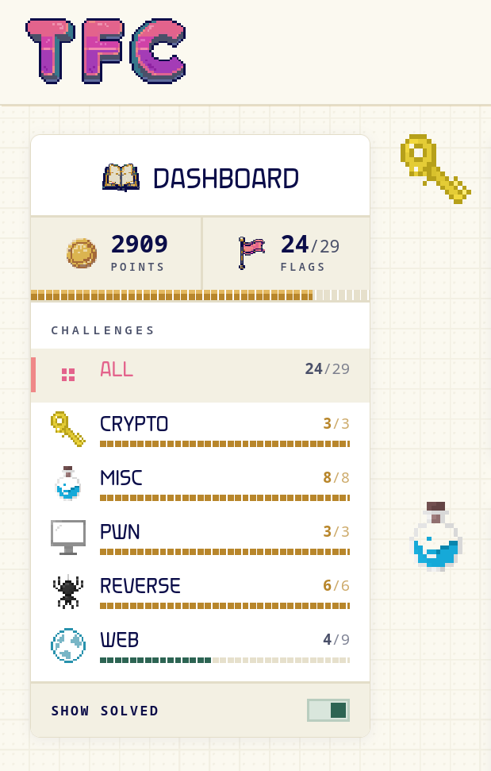
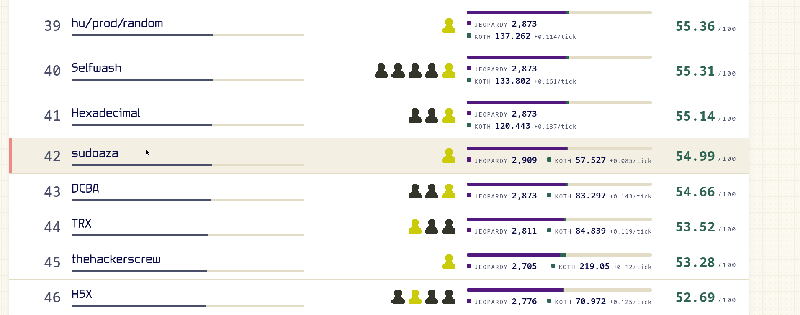

# TFC CTF 2026 — The Few Chosen

Team **sudoaza** · September 5–6, 2026 · **24 / 29 flags solved**

This is the full writeup folder for the TFC CTF 2026 ("thefewchosen") event.
Every solved challenge has its flag, the technique, and the full running log;
every unsolved challenge has the blocker and everything that was tried.

## Consolidated writeups

- [All 29 challenges — flags, techniques, blockers](WRITEUPS.md)
- [Solve log — flags + infra commands](SOLVED_SUMMARY.md)

## Per-challenge notes

**Solved (24):**

[`ariadne_s_tab`](challenges/ariadne_s_tab.md)  [`bitdebit`](challenges/bitdebit.md)  [`cadence`](challenges/cadence.md)  [`cer_frumos`](challenges/cer_frumos.md)  [`discord_shenanigans_v6`](challenges/discord_shenanigans_v6.md)  [`fishing_not_phishing`](challenges/fishing_not_phishing.md)  [`fluxion`](challenges/fluxion.md)  [`j_b_online_assessment`](challenges/j_b_online_assessment.md)  [`lumaes`](challenges/lumaes.md)  [`math_or_meth`](challenges/math_or_meth.md)  [`mid`](challenges/mid.md)  [`minigame`](challenges/minigame.md)  [`minigame2`](challenges/minigame2.md)  [`project_americas`](challenges/project_americas.md)  [`rivers`](challenges/rivers.md)  [`ship_me`](challenges/ship_me.md)  [`tagger`](challenges/tagger.md)  [`the_pyjail`](challenges/the_pyjail.md)  [`turip`](challenges/turip.md)  [`unbrevable`](challenges/unbrevable.md)  [`v8_motor`](challenges/v8_motor.md)  [`vaultkeeper`](challenges/vaultkeeper.md)  [`1_1`](challenges/1_1.md)  [`rules`](challenges/rules.md)

**Unsolved (5) — blockers + attempted routes:**

[`larpin`](challenges/larpin.md)  [`larpin2`](challenges/larpin2.md)  [`mccrab3`](challenges/mccrab3.md)  [`meshgate`](challenges/meshgate.md)  [`no_hot_water_club`](challenges/no_hot_water_club.md)

## Knowledge base (reusable techniques by category)

[`android.md`](knowledge/android.md)  [`crypto.md`](knowledge/crypto.md)  [`css-exfil.md`](knowledge/css-exfil.md)  [`forensics.md`](knowledge/forensics.md)  [`misc.md`](knowledge/misc.md)  [`pwn.md`](knowledge/pwn.md)  [`pyjail.md`](knowledge/pyjail.md)  [`reversing.md`](knowledge/reversing.md)  [`web.md`](knowledge/web.md)  [`xss.md`](knowledge/xss.md)

[`README`](knowledge/README.md)

## Highlights worth reading

- [`vaultkeeper`](challenges/vaultkeeper.md) — CVE-2024-38473: an encoded `?` in the path
  (`fetch_source.php%3Fooo.php`) defeats Apache `<FilesMatch>` + `Require ip 127.0.0.1`,
  unlocking the whole loopback SSRF → cap forge → SQLi → unserialize RCE chain.
- [`v8_motor`](challenges/v8_motor.md) — one-bit-flip V8 sandbox escape into wasm RWX shellcode.
- [`ship_me`](challenges/ship_me.md) — Android solver APK: self-enable an AccessibilityService
  via `WRITE_SECURE_SETTINGS`, then re-launch the exported target activity to read its window.
- [`no_hot_water_club`](challenges/no_hot_water_club.md) — byte-exact ML KV-cache reproduction:
  Intel SDE + QEMU TCG can emulate foreign x86 ISAs bit-exactly.
- [`css-exfil`](knowledge/css-exfil.md) — full CSS/out-of-band exfiltration playbook.
